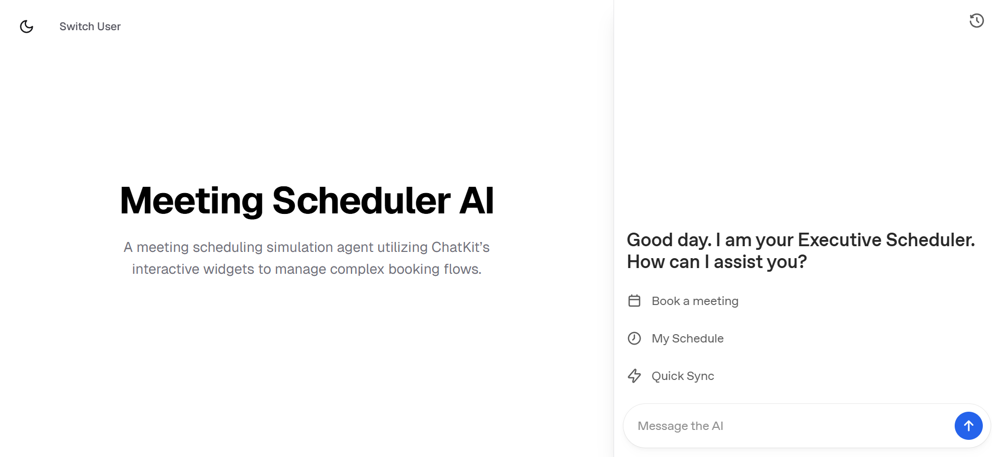
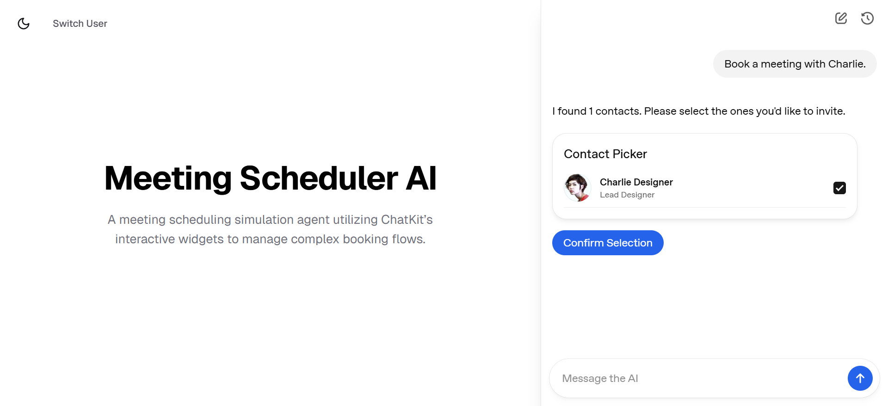
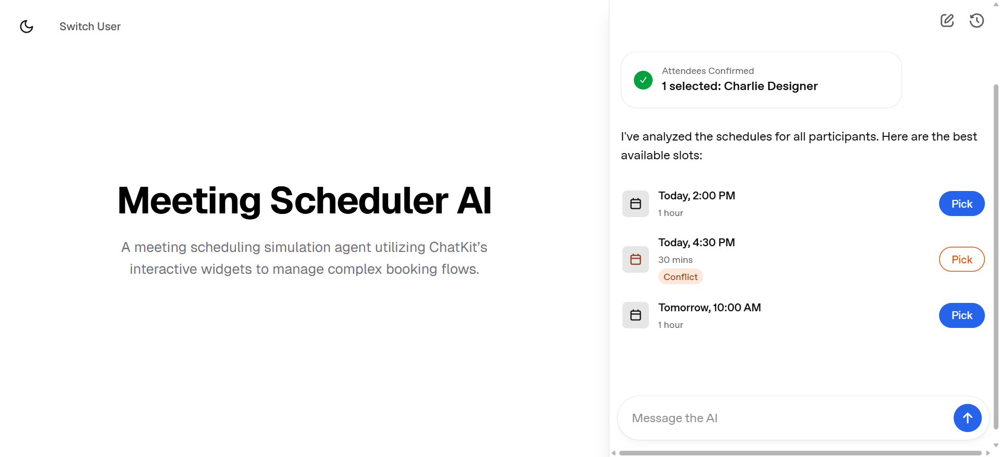
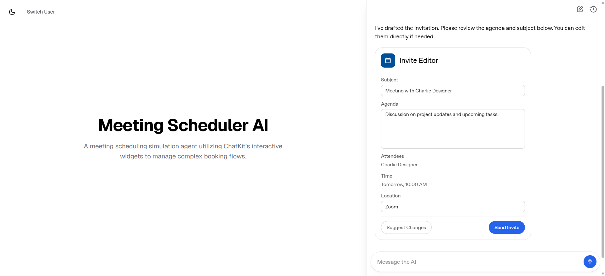
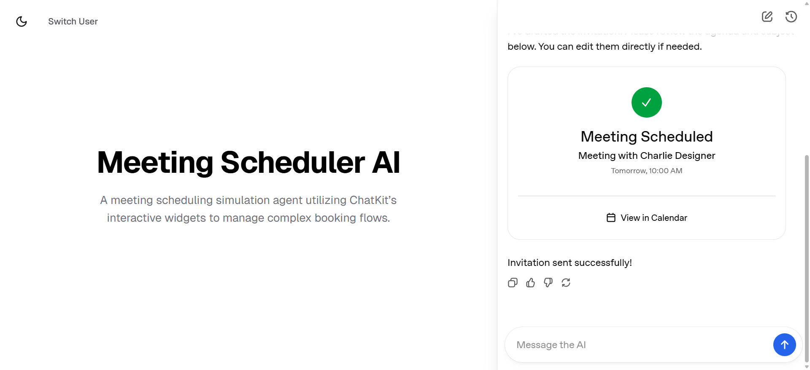

# Executive Meeting Scheduler AI

An advanced, human-in-the-loop (HITL) conversational AI Agent designed to transform the messy process of meeting coordination into a structured, visual experience. Built with **OpenAI ChatKit**, this application simulates how AI agents can move beyond simple text-based chat to manage complex business workflows using interactive UI widgets.



## 🚀 The Problem & Solution

**The Problem:** Coordinating meetings via standard chatbots is inefficient. It requires high cognitive load to clarify participant names, manually check dates, and proofread generated agendas before they are sent.

**The Solution:** This project utilizes a **state-machine agent** that uses specialized UI widgets to:
1.  **Disambiguate Contacts:** Visual list selection ensures you invite the right "Bob."
2.  **Visualize Availability:** A time-picker widget shows slots with conflict-awareness.
3.  **Enforce Review:** An editable form allows you to refine the subject and agenda *before* the invite is dispatched.






---

## 🛠️ Tech Stack

### Frontend
- **Framework:** Next.js 16 (App Router)
- **UI Framework:** Tailwind CSS 4
- **Chat Interface:** `@openai/chatkit-react`
- **Language:** TypeScript

### Backend
- **Server:** FastAPI (Python 3.12)
- **Agent Framework:** `openai-agents`
- **Protocol:** `openai-chatkit`
- **Database:** SQLite (via `aiosqlite`) for thread persistence and simulated corporate data.

---

## Project Architecture

### 1. The Multi-Widget Workflow
The agent follows a **Human-in-the-Loop** protocol defined in `scheduler.py`:

*   **Contact Picker:** Triggered via `search_contacts`. Displays a `ListView` of matches from the corporate directory.
*   **Time Picker:** Triggered via `find_availability`. Displays mock schedule data with visual "Conflict" badges.
*   **Invite Editor:** A `Card` rendered as a `Form`. Users can edit the Subject and Agenda directly in the chat bubble.
*   **Confirmation:** Once sent, the interactive form is replaced with a static "Meeting Scheduled" widget.

### 2. Hidden Context Strategy
To keep the LLM in sync with the user's UI actions without cluttering the chat history, the server injects `<USER_ACTION>` tags into the message stream. This allows the model to "know" which contact ID or time slot was selected via a button click.

---

## Getting Started

### Prerequisites
- OpenAI API Key
- Python 3.12+
- Node.js 18+

### 1. Backend Setup
```bash
cd backend
# Create and activate virtual environment
uv venv
source .venv/bin/activate # or .venv\Scripts\activate on Windows

# Install dependencies
uv sync

# Set your API Key
export OPENAI_API_KEY='your-key-here'

# Start the server (includes auto-seeding the SQLite DB)
uv run main.py
```

### 2. Frontend Setup
```bash
cd frontend
npm install

# Start the dev server
npm run dev
```

Visit `http://localhost:3000` to choose a persona (**Alice** or **Bob**) and start scheduling.

---

## 📂 Directory Structure

```text
├── backend/
│   ├── app/
│   │   ├── agents/      # LLM Instructions & Tool definitions
│   │   ├── widgets/     # JSON templates (.widget) & Python builders
│   │   ├── store/       # SQLite logic for Threads and Business data
│   │   └── server.py    # The ChatKit action handler (The State Machine)
│   └── main.py          # FastAPI entry point
└── frontend/
    ├── app/             # Next.js App Router
    ├── components/      # ChatKitPanel & Theme components
    └── lib/             # API configuration
```

---

## 💡 Key Features Highlight

- **Persona-Based Login:** Simulate different users (Alice/Executive vs. Bob/Manager) to see filtered contact lists and schedules.
- **Widget Replacement:** Uses `ThreadItemReplacedEvent` to turn interactive widgets into "read-only" summaries once a selection is made, preventing double-booking or UI state confusion.
- **Natural Language Revisions:** If the user doesn't like the drafted agenda, they can simply type *"Make the agenda more concise,"* and the agent will regenerate the **Invite Editor Widget** with updated content.
- **Theme Support:** Fully functional Light and Dark mode that syncs with the ChatKit internal UI.